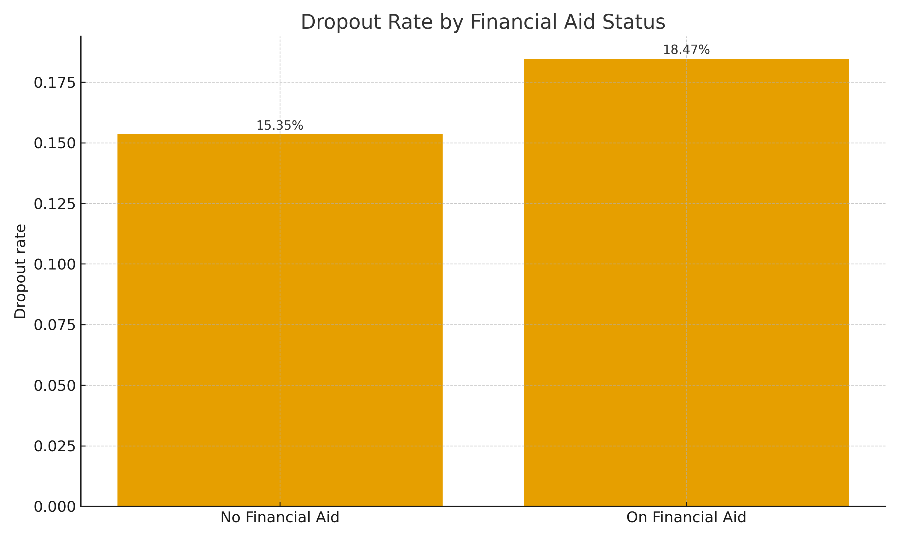
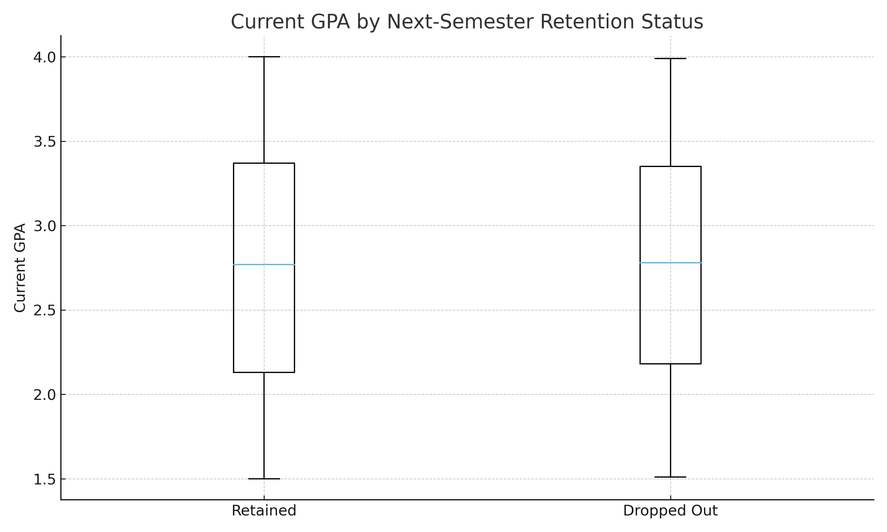
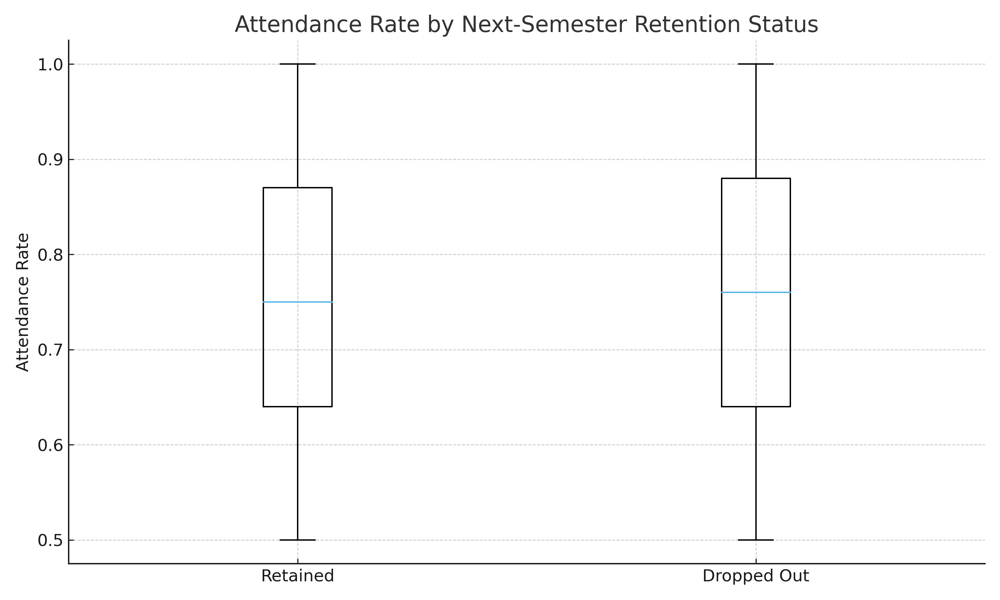

# Student Retention Analytics Portfolio (Anonymized)

## Higher-Ed Retention Case Study

I use this project to show how I approach retention questions with real-world constraints. The dataset includes 2,134 synthetic students with academic, demographic, engagement, and outcome variables that mirror a modern university environment.

The goal is simple. Move from raw data to a set of clear, defensible insights that a vice provost or dean can act on without needing to read code.

---

## Professional Summary

I help institutions turn messy data into decisions. My background spans survey analytics, student success, and institutional research, with experience using Python, SPSS, R, SQL, Tableau, and Power BI to support academic and enrollment leaders.

I focus on reproducible workflows, transparent assumptions, and outputs that non-technical stakeholders can understand and use.

---

## Technical Skills used in this project

Programming and analysis rely on Python with Pandas, NumPy, Matplotlib, Statsmodels, and SciPy. The workflow mirrors what I would run in a Jupyter notebook or in production scripts.

Visualization draws on Matplotlib for static dashboards that are easy to ship to GitHub Pages. For modeling, I use Statsmodels for interpretable regression and logistic models.

---

## Project: Multimodal Student Retention Dataset

This dataset simulates:

Academic performance through current and historical GPA, credits completed, and academic warnings.  
Engagement and continuity through attendance rate, advisor meeting counts, and enrollment gaps.  
Student context through age, gender, ethnicity, major, and financial aid status.  
Outcomes through next-semester dropout, dropout type, dropout duration, and recorded cause.

There are 2,134 students in the sample. About 83% are retained into the next semester and about 17% drop out, which is enough non-returners to support meaningful analysis.

---

## Dashboard

### Visual 1 — Overall Retention vs Dropout

In this chart, 1,773 students return the next semester and 361 do not. That translates to roughly 83% retained and 17% dropped.

The picture is encouraging because most students persist, yet the group of 361 non-returners is large enough to matter in budget, course planning, and student success metrics.

---

### Visual 2 — Dropout Rate by Major

Dropout rates range from about 15.8% in Business up to about 18.5% in Psychology. Computer Science, Electrical Engineering, and Biology sit in the middle, in the 16–17% range.

The variation across majors is modest rather than dramatic, which suggests systemic factors are at least as important as program-specific ones. It still hints that psychology programs might benefit from a closer look at advising, workload, or student support.

---

### Visual 3 — Dropout Rate by Financial Aid Status

Students without aid have a dropout rate around 15.3%. Students with aid have a rate closer to 18.5%.

The difference aligns with the idea that students who rely on aid may be operating with thinner financial margins. Even though the difference is not enormous, it is large enough to watch in dashboards and to test with statistics.

---

### Visual 4 — Dropout Rate by Gender

Female students show a dropout rate of about 19.7%. Male students are closer to 14.6%. Students categorized as “Other” fall in between at about 16.4%.

The gap between female and male students is noticeable. It suggests that any retention strategy should check for gendered patterns in experience, workload, family responsibilities, or advising engagement before assuming a one-size-fits-all approach.

---

### Visual 5 — Dropout Rate by Ethnicity

In this sample, White students have the lowest dropout rate at about 12.9%. Asian students are around 16.4%, while Black, Hispanic, and “Other” students cluster between about 17.9% and 18.8%.

These differences are not extreme, but they are consistent across groups. They point toward equity questions and the need for disaggregated dashboards, even in a synthetic dataset.

---

### Visual 6 — Current GPA by Retention Status

The boxplot compares current GPA for students who are retained versus those who drop out. The distributions overlap heavily.

In this dataset, GPA alone does not create a sharp separation between leavers and persisters. That tells a realistic story: many students who leave are not strictly failing, and risk is more complex than a single GPA threshold.

---

### Visual 7 — Attendance Rate by Retention Status

Attendance rates for retained and non-retained students again show overlap. Median attendance is high for both groups, and there is no dramatic cliff where students below a certain threshold always leave.

This pattern reinforces the idea that engagement signals such as attendance matter, but they function more as part of a risk profile than as a single cut-score that can drive decisions by itself.

---

### Visual 8 — Types of dropout among non-returners

Among the 361 students who do not return, 130 are classified as temporary dropouts, 117 as permanent, and 114 as transfers.

This mix matters. Transfers and temporary stop-outs do not have the same financial and reputational impact as permanent withdrawals. Leaders need to distinguish between “lost to the institution” and “stepping away” when they talk about retention.

---

### Visual 9 — Reported causes of dropout

Reported causes are distributed across Academic (93 students), Financial (87), Mental Health (90), and Other (91). No single cause dominates the picture.

Dropout is a multi-factor story here. The nearly even split between academic, financial, and mental health reasons mirrors what many institutions see in practice. Effective interventions need to be cross-functional, not just academic or financial.

---

### Visual 10 — GPA Trajectory across four semesters

Average GPA is tracked across four semesters for retained versus dropout students. The lines move in similar ranges and do not diverge dramatically.

This trajectory suggests that many students who leave do not show a simple pattern of steady academic decline. Early-warning systems need to combine GPA with other signals like warnings, advising notes, and enrollment gaps rather than waiting for GPA to collapse.

---

### Visual 11 — Correlation Heatmap

The red heatmap summarizes correlations among key numeric variables. Current and historical GPA correlate very strongly with each other. Dropout risk and next-semester dropout move together, as expected, and both align with dropout duration.

Almost all other correlations with next-semester dropout are weak. That is realistic in student success work. Retention is influenced by many small nudges rather than one overwhelmingly predictive variable.

---

## Statistical Analysis

Detailed pages in this site show the raw statistics and full model output.

- [Descriptive Statistics](./retention_desc_stats.html)  
- [Correlation Matrix](./retention_corr_matrix.html)  
- [Chi-square: Financial Aid × Dropout](./retention_chi_square_fin_aid_vs_dropout.html)  
- [Logistic Regression: Next-semester Dropout](./retention_logit_dropout_model.html)

These pages pair numeric output with short, plain-language interpretations that describe what stands out, what it means, and how a leader could act on it.

---

## Takeaways for Institutional Leaders

The dataset tells a story of mostly successful students, with about one in six leaving by the next term. Demographic, academic, and financial patterns all tilt risk slightly but none tells the whole story alone.

For practice, that means dashboards should layer multiple signals. Retention work becomes more powerful when it treats dropout as a complex decision shaped by small pushes rather than a simple GPA problem.

For employers, this project shows how I structure data work so that every graph and model leads back to an actionable question: who is at risk, why, and what the institution can do next.
